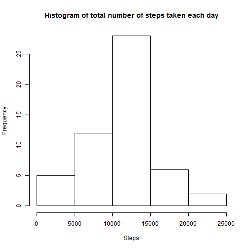
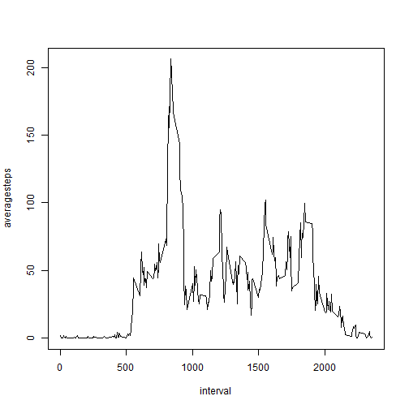
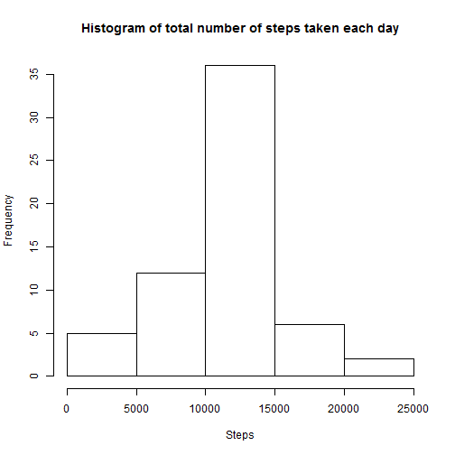
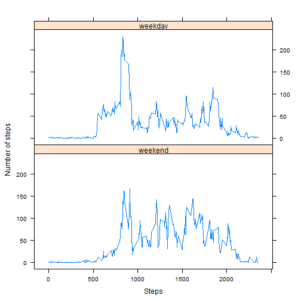

## Loading and preprocessing the data
Show any code that is needed to
1. Load the data (i.e. read.csv())
2. Process/transform the data (if necessary) into a format suitable for your analysis

```r
data <- read.csv(file = "activity.csv",header=TRUE,sep=",",quote = "\"")
summary(data)
```

```
##      steps                date          interval     
##  Min.   :  0.00   2012-10-01:  288   Min.   :   0.0  
##  1st Qu.:  0.00   2012-10-02:  288   1st Qu.: 588.8  
##  Median :  0.00   2012-10-03:  288   Median :1177.5  
##  Mean   : 37.38   2012-10-04:  288   Mean   :1177.5  
##  3rd Qu.: 12.00   2012-10-05:  288   3rd Qu.:1766.2  
##  Max.   :806.00   2012-10-06:  288   Max.   :2355.0  
##  NA's   :2304     (Other)   :15840
```

## What is mean total number of steps taken per day?
For this part of the assignment, you can ignore the missing values in the dataset.
1. Calculate the total number of steps taken per day

```r
daysummary <- aggregate(data$steps,by = list(date = data$date), FUN=sum)
summary(daysummary)
```

```
##          date          x        
##  2012-10-01: 1   Min.   :   41  
##  2012-10-02: 1   1st Qu.: 8841  
##  2012-10-03: 1   Median :10765  
##  2012-10-04: 1   Mean   :10766  
##  2012-10-05: 1   3rd Qu.:13294  
##  2012-10-06: 1   Max.   :21194  
##  (Other)   :55   NA's   :8
```

2. If you do not understand the difference between a histogram and a barplot, research the difference between them. Make a histogram of the total number of steps taken each day


```r
hist(daysummary$x,main = "Histogram of total number of steps taken each day",xlab = "Steps",ylab = "Frequency")
```

 

3. Calculate and report the mean and median of the total number of steps taken per day

The mean of the toltal number of steps taken each day is:

```r
mean(daysummary$x,na.rm = TRUE)
```

```
## [1] 10766.19
```
The median of the total number of steps taken each day is:

```r
median(daysummary$x,na.rm = TRUE)
```

```
## [1] 10765
```

## What is the average daily activity pattern?
1. Make a time series plot (i.e. type = "l") of the 5-minute interval (x-axis) and the average number of steps taken, averaged across all days (y-axis)

```r
newdata <- data[complete.cases(data),]
averagesteps <- tapply(newdata$steps, as.factor(newdata$interval), mean)
interval <- names(tapply(newdata$steps, as.factor(newdata$interval), mean))
plot(interval,averagesteps,type = "l")
```

 

2. Which 5-minute interval, on average across all the days in the dataset, contains the maximum number of steps?


```r
interval[averagesteps == max(averagesteps)]
```

```
## [1] "835"
```

## Imputing missing values
Note that there are a number of days/intervals where there are missing values (coded as NA). The presence of missing days may introduce bias into some calculations or summaries of the data.
1. Calculate and report the total number of missing values in the dataset (i.e. the total number of rows with NAs)

```r
sum(is.na(data$steps))
```

```
## [1] 2304
```
2. Devise a strategy for filling in all of the missing values in the dataset. The strategy does not need to be sophisticated. For example, you could use the mean/median for that day, or the mean for that 5-minute interval, etc.

I am using the mean for that 5-minute inerval as the value to fill NAs.Codes are in the next part.

3. Create a new dataset that is equal to the original dataset but with the missing data filled in.


```r
fulldf <- data
for (i in 1:length(data$steps))
  if(is.na(fulldf$steps[i]))
    fulldf$steps[i] <- averagesteps[match(fulldf$interval[i],interval)]
```

4. Make a histogram of the total number of steps taken each day and Calculate and report the mean and median total number of steps taken per day. Do these values differ from the estimates from the first part of the assignment? What is the impact of imputing missing data on the estimates of the total daily number of steps?


```r
fulldaysummary <- aggregate(fulldf$steps,by = list(date = fulldf$date), FUN=sum)
```

The histogram of the total number of steps taken each day is:


```r
hist(fulldaysummary$x,main = "Histogram of total number of steps taken each day",xlab = "Steps",ylab = "Frequency")
```

 

The Frequency of each steps are different from the previous data with NAs since we have more data points. After filling the NAs, the distribution of the histogram is also changed since the frequency has changed.

The mean of the toltal number of steps taken each day after filling NAs is:

```r
mean(fulldaysummary$x)
```

```
## [1] 10766.19
```
To check if the mean value is the same or not:

```r
mean(fulldaysummary$x) == mean(daysummary$x,na.rm = TRUE)
```

```
## [1] TRUE
```

The median of the total number of steps taken each day is:

```r
median(fulldaysummary$x)
```

```
## [1] 10766.19
```
To check if the median value is the same or not:

```r
median(fulldaysummary$x) == median(daysummary$x,na.rm = TRUE)
```

```
## [1] FALSE
```

## Are there differences in activity patterns between weekdays and weekends?
For this part the weekdays() function may be of some help here. Use the dataset with the filled-in missing values for this part.
1. Create a new factor variable in the dataset with two levels - "weekday" and "weekend" indicating whether a given date is a weekday or weekend day.

```r
fulldf$date = as.Date(fulldf$date)
weekdays1 <- c('Monday', 'Tuesday', 'Wednesday', 'Thursday', 'Friday')
fulldf$weekfactor <- factor((weekdays(fulldf$date) %in% weekdays1), 
         levels=c(FALSE, TRUE), labels=c('weekend', 'weekday')) 
```
2. Make a panel plot containing a time series plot (i.e. type = "l") of the 5-minute interval (x-axis) and the average number of steps taken, averaged across all weekday days or weekend days (y-axis). See the README file in the GitHub repository to see an example of what this plot should look like using simulated data.


```r
library(lattice)

averagesteps2 <- tapply(fulldf$steps, list(as.factor(fulldf$interval),fulldf$weekfactor), mean)
interval2 <- as.numeric(row.names(averagesteps2))
averagesteps2 <- as.data.frame(averagesteps2)
f <- rep(0:1,each = length(interval2))
f <- factor(f, labels = c("weekend","weekday"))
fullinterval <- rep(interval2,2)
fullsteps <- c(averagesteps2$weekend,averagesteps2$weekday)
plotdf <- as.data.frame(cbind(fullinterval,fullsteps))
xyplot(plotdf$fullsteps~plotdf$fullinterval | f,layout = c(1,2),type = "l",xlab = "Steps", ylab = "Number of steps")
```

 

